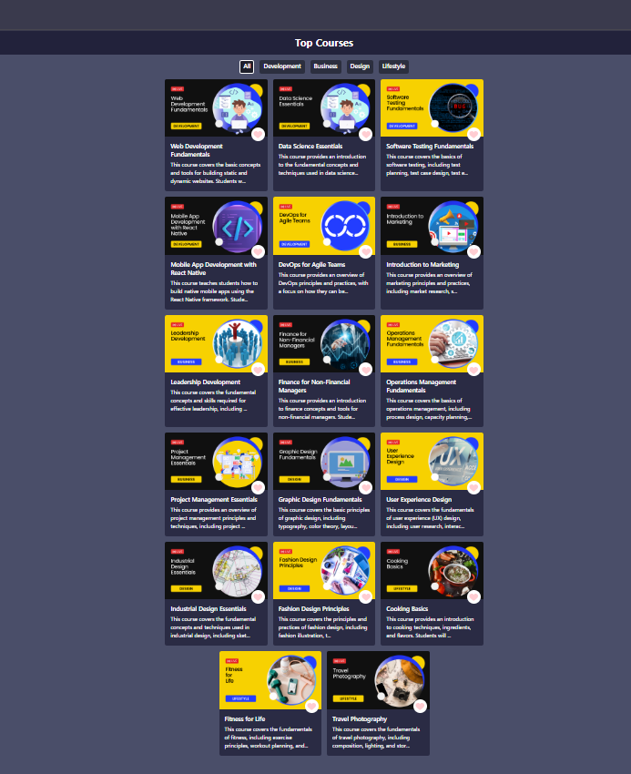
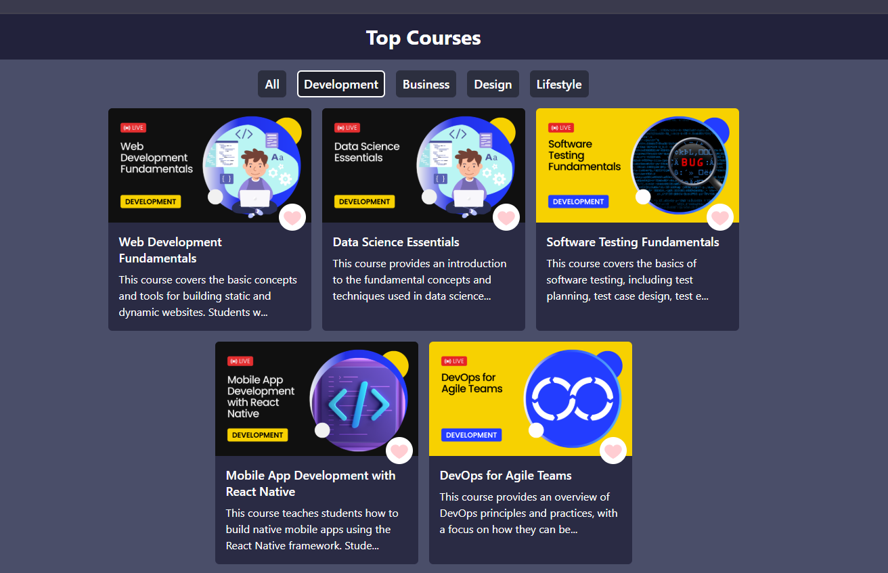

# 📚 Course Explorer

A sleek and responsive course listing interface built using **React** and **Tailwind CSS**. 
This project demonstrates the use of key React hooks like `useState`, `useEffect`, and JS array methods like `map` and `filter`.

## 🚀 Features

- Dynamic filtering by category (Development, Business, Design, Lifestyle)
- Responsive UI using Tailwind CSS
- Reusable components
- Clean and readable structure

## 🛠️ Tech Stack

- React.js
- Tailwind CSS
- JavaScript (ES6+)

## 📂 Project Structure
# 📚 Course Explorer

A sleek and responsive course listing interface built using **React** and **Tailwind CSS**. This project demonstrates the use of key React hooks like `useState`, `useEffect`, and JS array methods like `map` and `filter`.

## 🚀 Features

- Dynamic filtering by category (Development, Business, Design, Lifestyle)

  
  
- Responsive UI using Tailwind CSS
- Reusable components
- Clean and readable structure

## 🛠️ Tech Stack

- React.js
- Tailwind CSS
- JavaScript (ES6+)

## 📂 Project Structure

# 📚 Course Explorer

A sleek and responsive course listing interface built using **React** and **Tailwind CSS**. This project demonstrates the use of key React hooks like `useState`, `useEffect`, and JS array methods like `map` and `filter`.

## 🚀 Features

- Dynamic filtering by category (Development, Business, Design, Lifestyle)
- Responsive UI using Tailwind CSS
- Reusable components
- Clean and readable structure

## 🛠️ Tech Stack

- React.js
- Tailwind CSS
- JavaScript (ES6+)

## 📂 Project Structure
src/
├── components/
│ ├── CourseCard.jsx
│ └── FilterBar.jsx
├── App.jsx
├── data.js // course data
└── index.js

